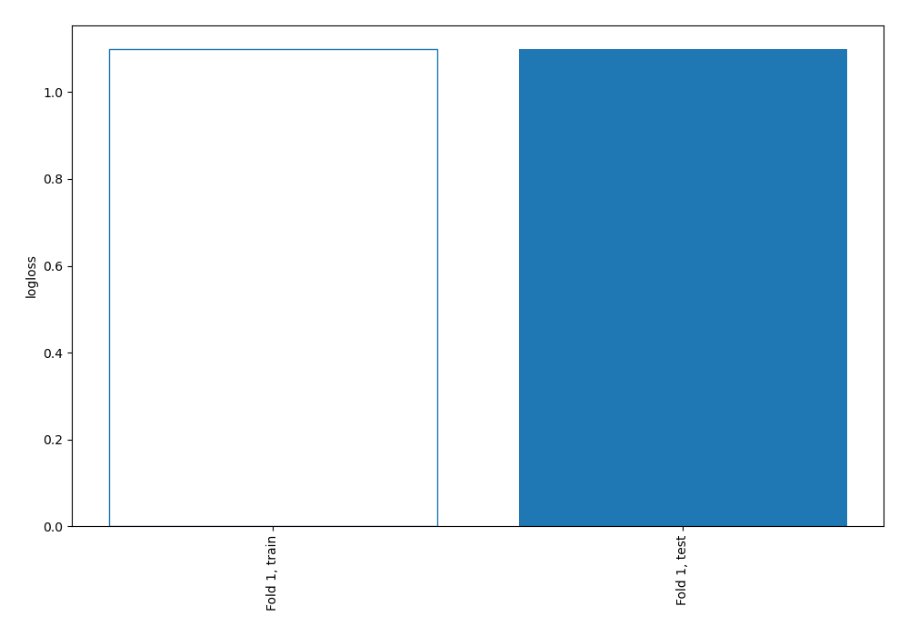
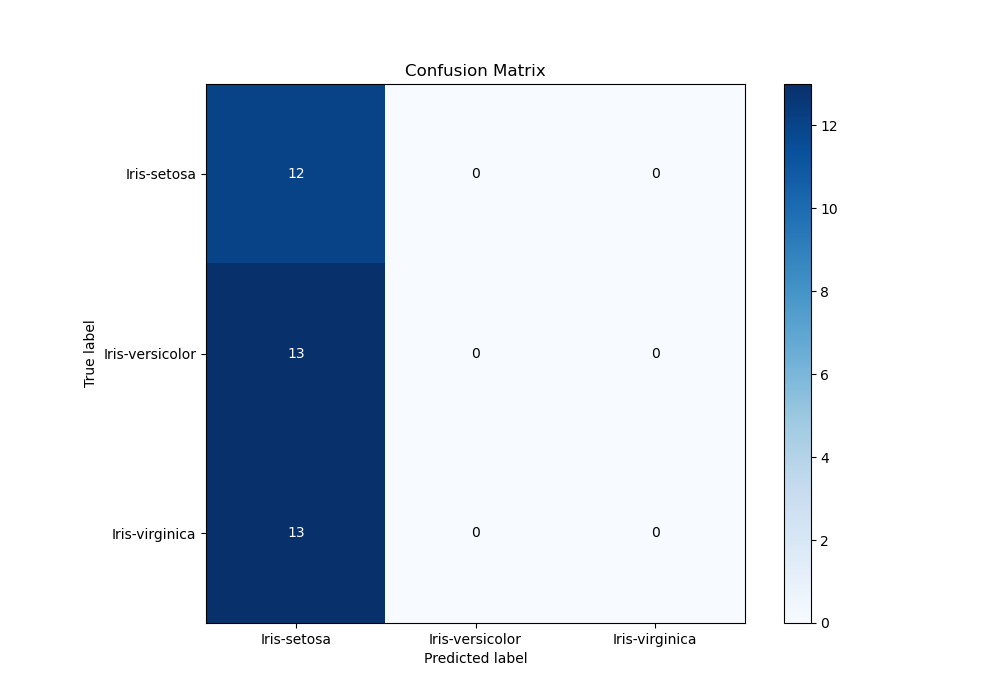
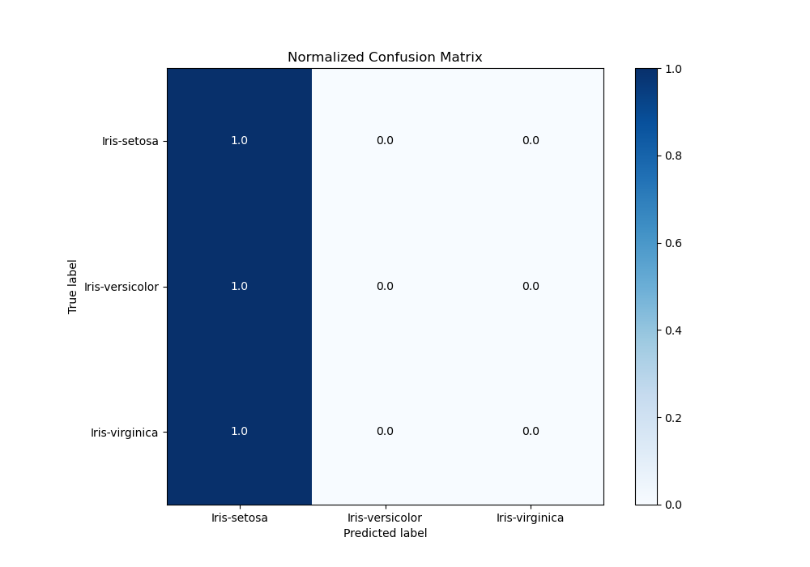
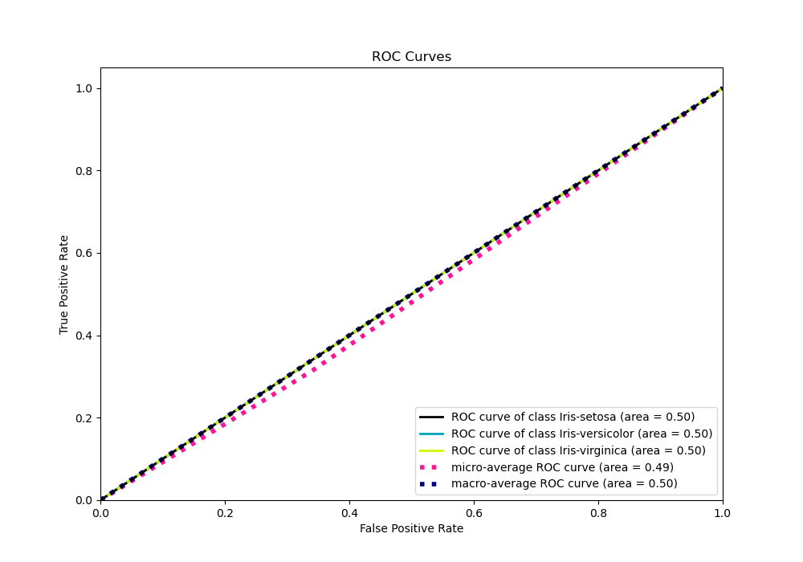
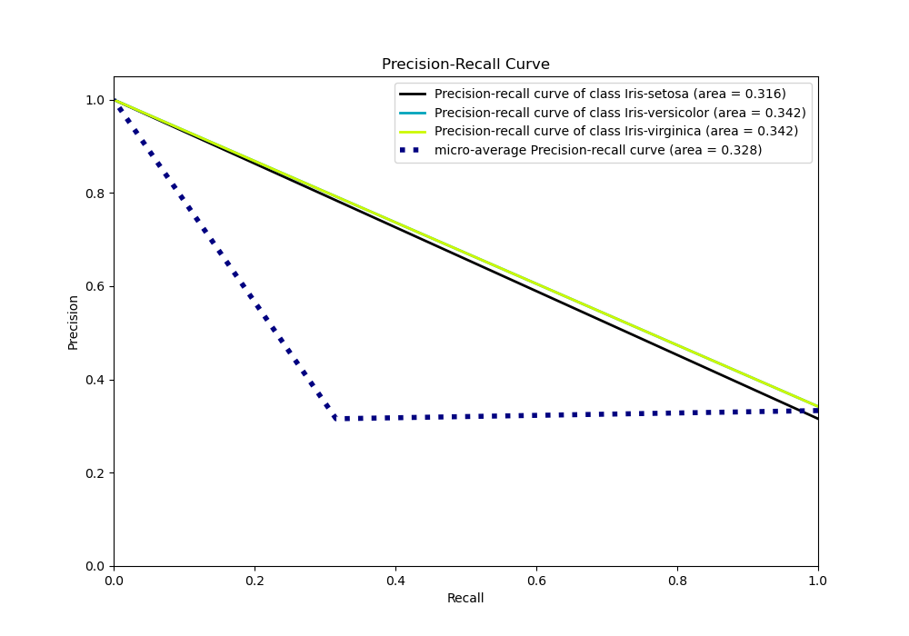

# Summary of 1_Baseline

[<< Go back](../README.md)

## Baseline Classifier (Baseline)
- **n_jobs**: -1
- **num_class**: 3
- **explain_level**: 2

## Validation
 - **validation_type**: split
 - **train_ratio**: 0.75
 - **shuffle**: True
 - **stratify**: True

## Optimized metric
logloss

## Training time

0.6 seconds

### Metric details
|           |   Iris-setosa |   Iris-versicolor |   Iris-virginica |   accuracy |   macro avg |   weighted avg |   logloss |
|:----------|--------------:|------------------:|-----------------:|-----------:|------------:|---------------:|----------:|
| precision |      0.315789 |                 0 |                0 |   0.315789 |    0.105263 |       0.099723 |   1.09916 |
| recall    |      1        |                 0 |                0 |   0.315789 |    0.333333 |       0.315789 |   1.09916 |
| f1-score  |      0.48     |                 0 |                0 |   0.315789 |    0.16     |       0.151579 |   1.09916 |
| support   |     12        |                13 |               13 |   0.315789 |   38        |      38        |   1.09916 |

## Confusion matrix
|                            |   Predicted as Iris-setosa |   Predicted as Iris-versicolor |   Predicted as Iris-virginica |
|:---------------------------|---------------------------:|-------------------------------:|------------------------------:|
| Labeled as Iris-setosa     |                         12 |                              0 |                             0 |
| Labeled as Iris-versicolor |                         13 |                              0 |                             0 |
| Labeled as Iris-virginica  |                         13 |                              0 |                             0 |

## Learning curves

## Confusion Matrix

## Normalized Confusion Matrix

## ROC Curve

## Precision Recall Curve

[<< Go back](../README.md)
