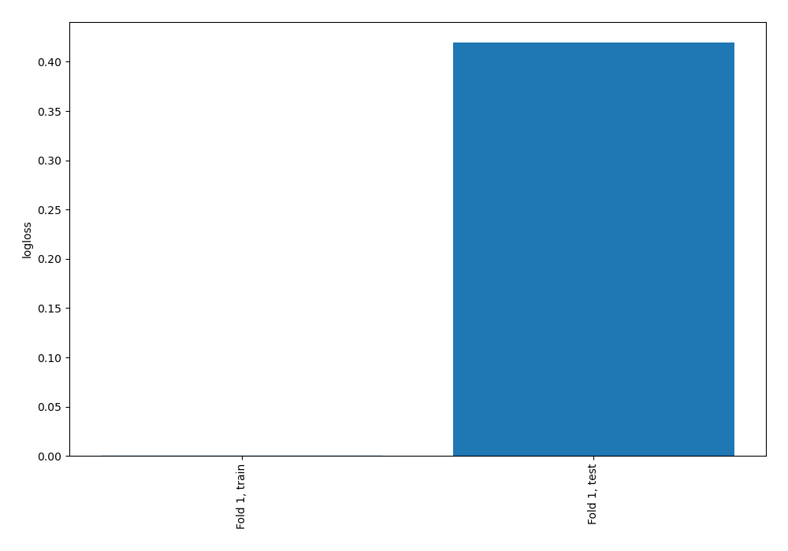
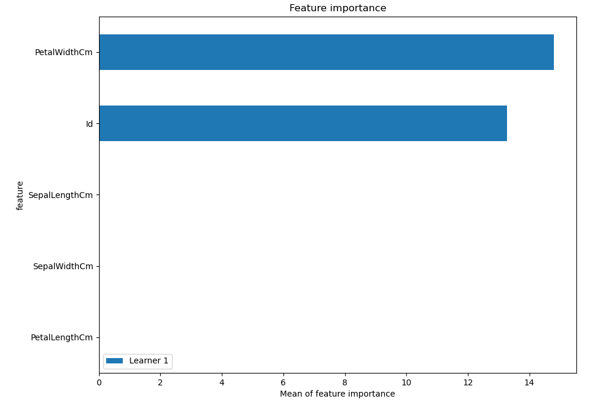
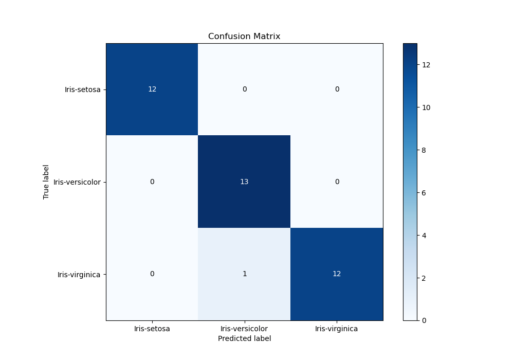
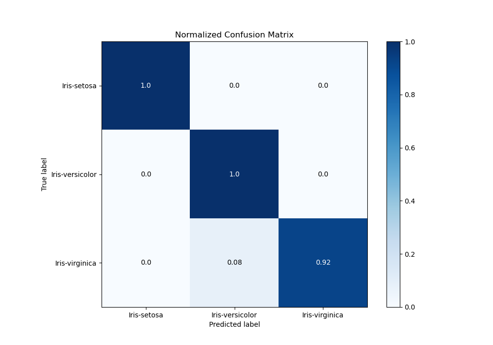
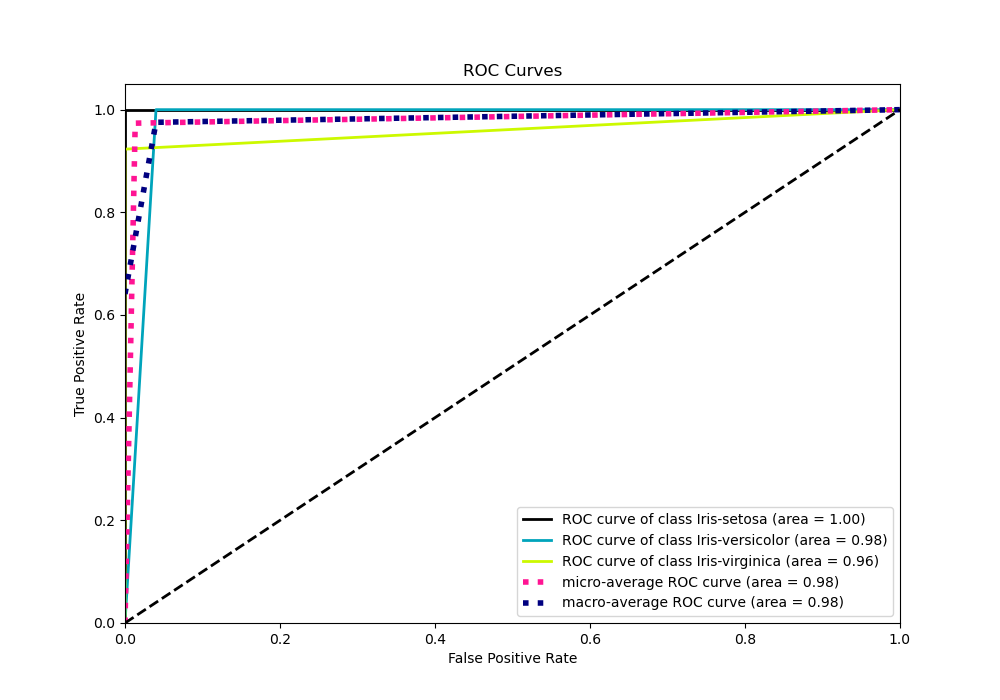
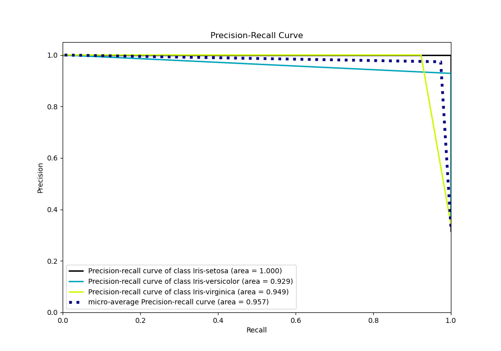

# Summary of 2_DecisionTree

[<< Go back](../README.md)

## Decision Tree
- **n_jobs**: -1
- **criterion**: gini
- **max_depth**: 3
- **num_class**: 3
- **explain_level**: 2

## Validation
 - **validation_type**: split
 - **train_ratio**: 0.75
 - **shuffle**: True
 - **stratify**: True

## Optimized metric
logloss

## Training time

15.3 seconds

### Metric details
|           |   Iris-setosa |   Iris-versicolor |   Iris-virginica |   accuracy |   macro avg |   weighted avg |   logloss |
|:----------|--------------:|------------------:|-----------------:|-----------:|------------:|---------------:|----------:|
| precision |             1 |          0.928571 |         1        |   0.973684 |    0.97619  |       0.975564 |  0.419537 |
| recall    |             1 |          1        |         0.923077 |   0.973684 |    0.974359 |       0.973684 |  0.419537 |
| f1-score  |             1 |          0.962963 |         0.96     |   0.973684 |    0.974321 |       0.973645 |  0.419537 |
| support   |            12 |         13        |        13        |   0.973684 |   38        |      38        |  0.419537 |

## Confusion matrix
|                            |   Predicted as Iris-setosa |   Predicted as Iris-versicolor |   Predicted as Iris-virginica |
|:---------------------------|---------------------------:|-------------------------------:|------------------------------:|
| Labeled as Iris-setosa     |                         12 |                              0 |                             0 |
| Labeled as Iris-versicolor |                          0 |                             13 |                             0 |
| Labeled as Iris-virginica  |                          0 |                              1 |                            12 |

## Learning curves

## Permutation-based Importance

## Confusion Matrix

## Normalized Confusion Matrix

## ROC Curve

## Precision Recall Curve

[<< Go back](../README.md)
