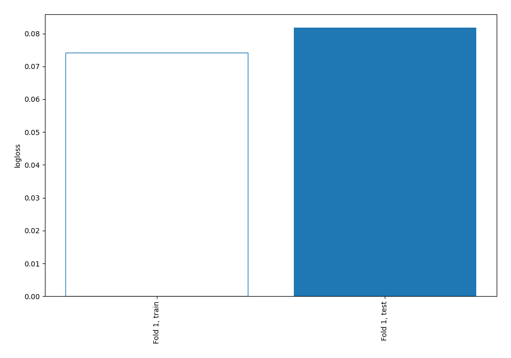
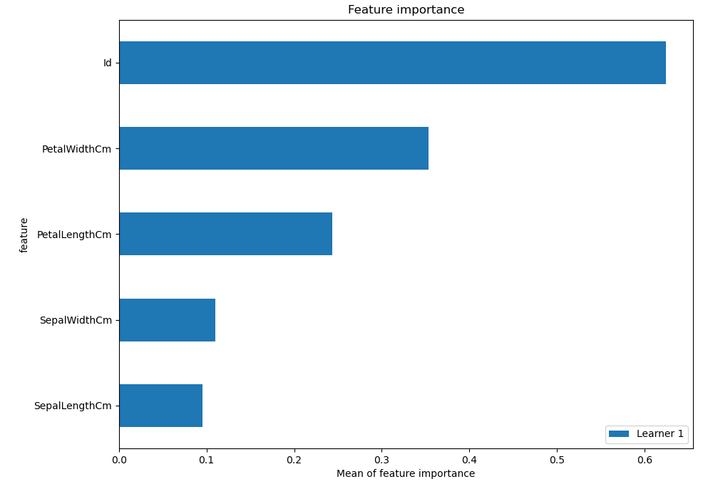
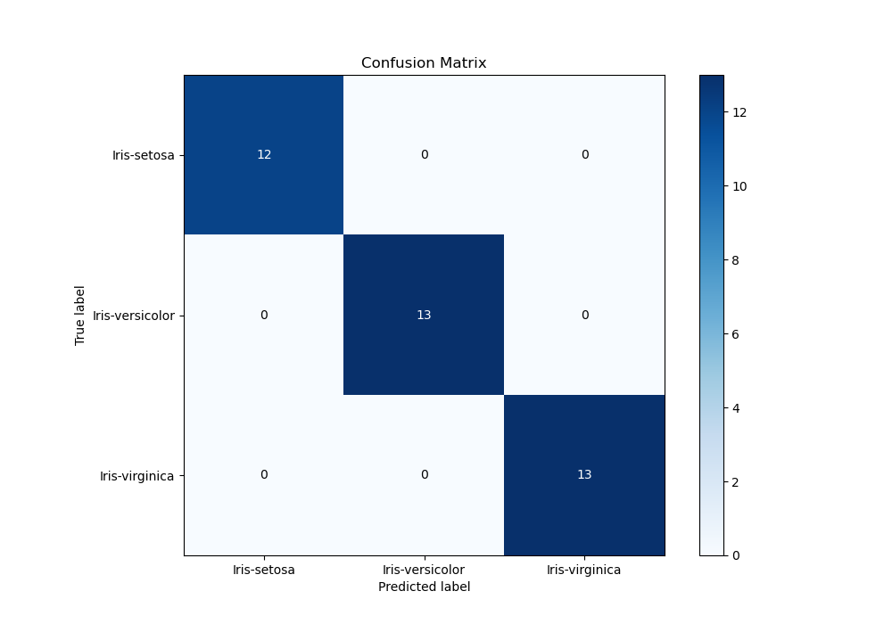
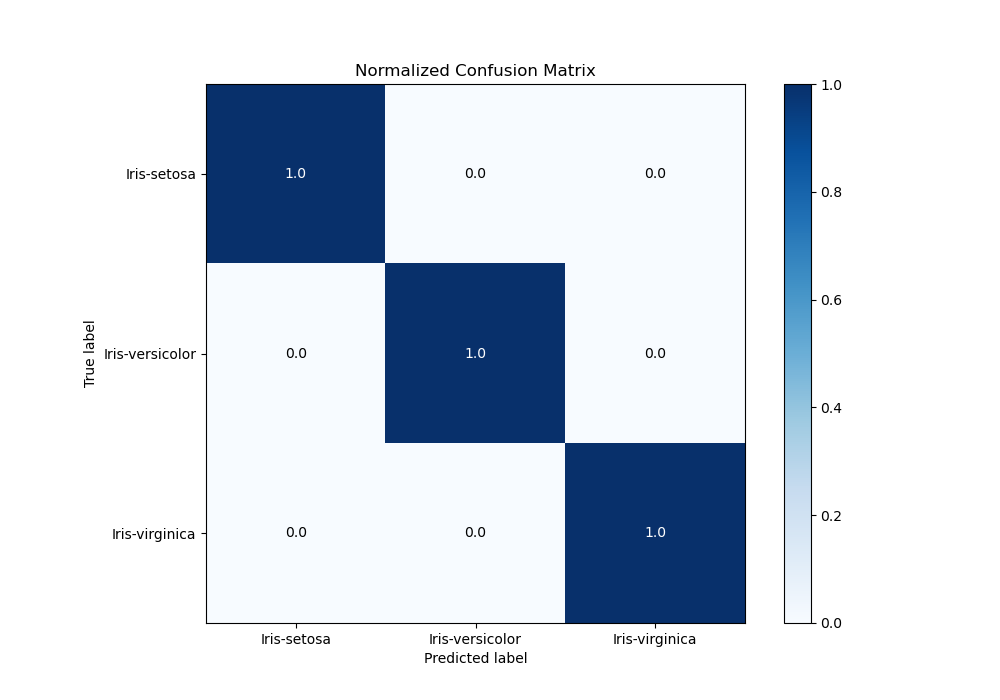
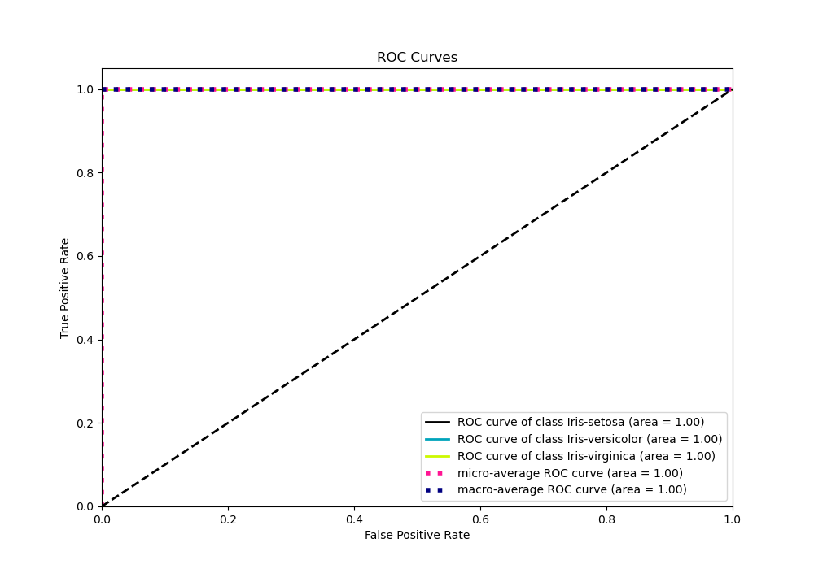
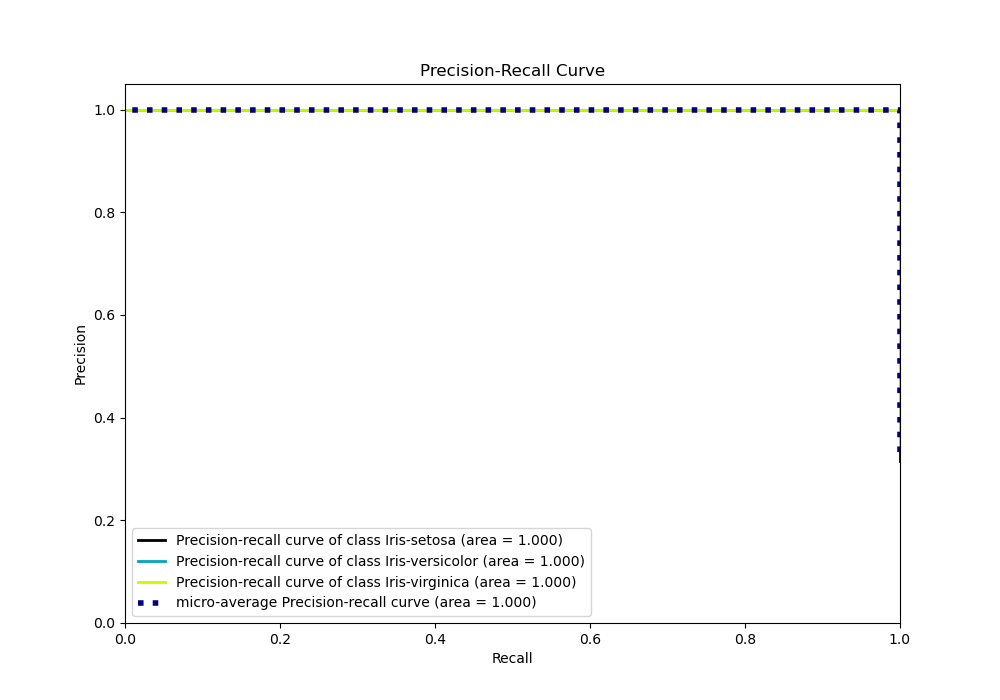

# Summary of 3_Linear

[<< Go back](../README.md)

## Logistic Regression (Linear)
- **n_jobs**: -1
- **num_class**: 3
- **explain_level**: 2

## Validation
 - **validation_type**: split
 - **train_ratio**: 0.75
 - **shuffle**: True
 - **stratify**: True

## Optimized metric
logloss

## Training time

0.7 seconds

### Metric details
|           |   Iris-setosa |   Iris-versicolor |   Iris-virginica |   accuracy |   macro avg |   weighted avg |   logloss |
|:----------|--------------:|------------------:|-----------------:|-----------:|------------:|---------------:|----------:|
| precision |             1 |                 1 |                1 |          1 |           1 |              1 | 0.0817893 |
| recall    |             1 |                 1 |                1 |          1 |           1 |              1 | 0.0817893 |
| f1-score  |             1 |                 1 |                1 |          1 |           1 |              1 | 0.0817893 |
| support   |            12 |                13 |               13 |          1 |          38 |             38 | 0.0817893 |

## Confusion matrix
|                            |   Predicted as Iris-setosa |   Predicted as Iris-versicolor |   Predicted as Iris-virginica |
|:---------------------------|---------------------------:|-------------------------------:|------------------------------:|
| Labeled as Iris-setosa     |                         12 |                              0 |                             0 |
| Labeled as Iris-versicolor |                          0 |                             13 |                             0 |
| Labeled as Iris-virginica  |                          0 |                              0 |                            13 |

## Learning curves

## Coefficients

### Coefficients learner #1
|               |   Iris-setosa |   Iris-versicolor |   Iris-virginica |
|:--------------|--------------:|------------------:|-----------------:|
| intercept     |     -0.141434 |         1.93563   |        -1.7942   |
| Id            |     -1.15275  |        -0.880768  |         2.03351  |
| SepalLengthCm |     -0.876584 |         0.416107  |         0.460477 |
| SepalWidthCm  |      0.985562 |        -0.48488   |        -0.500682 |
| PetalLengthCm |     -1.39428  |         0.0552341 |         1.33904  |
| PetalWidthCm  |     -1.35971  |        -0.28587   |         1.64558  |

## Permutation-based Importance

## Confusion Matrix

## Normalized Confusion Matrix

## ROC Curve

## Precision Recall Curve

[<< Go back](../README.md)
